# Used Car Sale Price Linear Prediction Model


## Hypothesis

Our project is an exploration as to whether we can use statistical analysis to predict the price of a used car based on the variables typically supplied by auto dealers and manufacturers.

## Data Collection and Cleaning

Through scraping of Cars.com ([code here)](01_webscraping-final.ipynb)), we were able to obtain 2607 observations post cleaning.  Our criteria was that these were dealer sold only, located within 10 miles of zip code 10004, no restriction on make or models, and that the model years were limited between 2014 to 2018.  These observations, post scraping were stored in 2 separate JSON files representing the 2 attempts we made to scrape data, the first to test our scraping code, the second to increase our sample size and avoid being blocked from the page altogether.  A third attempt was made to increase our sample size, however this led to our IP address being blocked for 2 days and thus we were unable to increase our sample size in the time given.

Factors that were cleaned included observations where information in the particular listing was not available for the below categories([code here](02_Clean_and_Prepare_Data.ipynb)):  


**Mileage**

**Miles per gallon**

**Year**

Additionally, the data was pruned back to remove high-priced outliers representing rare cars like Bentleys are Rolls Royces.  Those makes were not specifically targeted for removal, but where their prices exceeded $90,000, we felt were not truly representative of the majority of the used car market.  We however, did fail to account for typos in car listing, particularly for 1 2017 Toyota Highlander that was priced unusally low at $3298.  Our initial assumption was that there was something wrong with the car that the dealer was not required to list in the standard car statistics but may have been available in the description.  It was later determined after modelling that this was a typo in the listing at the time of data gathering and that the true price should have included an extra 0, bringing the price to $32,980.  Further refinement of the model will include removal of this outlier, or a more thorough vetting of the data to watch out for these errors.

Further columns were removed from the data set which were regarded as not pertinent to our model.  This included the following categories:


**VIN number**

**Stock number**

**Internal color**

**Trim** 

- **VIN number** and **stock number** were removed as they were not pertinent to modeling price comparison, although we do recognize they can play a role in a customer's purchase decision via a VIN lookup or enquiries of availability to the particular dealer listing the car, they do not materially affect the price.
- **Internal color** was judged as immaterial to value as manufacturers typically match certain interior colors with external colors, leaving very little choice for the consumer.  While certainly relevant to a buyer's interest, unless the color was unusual or custom, it was estimated that it would have little bearing on price.  We did check the colors present in the data set and did not notice any that particularly stood out as being a custom job.  Again, as with VIN and Stock Number, they may effect whether or not the car is purchased, but does not affect the final price.
- Lastly **trim**, while available as a category was frequently NOT filled in by dealers.  That information is typically assumed with the particular car model, and through enquiries we were able to determine that any extra packages that a car may possess is not factored into pricing by dealerships looking to buy tradeins which they then turn around to sell.  

## Analysis
[code here](03_EDA.ipynb)

Our initial analysis of the data started with a pairplot using the Python Seaborn library.  Initial results using all available continuous variables resulted in no obvious associations or correlations, as seen below:

[initial data](images/initialdata.png)

Further examination through the OLS Stats function from the SciPy library revealed some correlation, but not enough to reliable use any of the continuous variables indivudually to help predict price.  The results of our regression analysis are below:

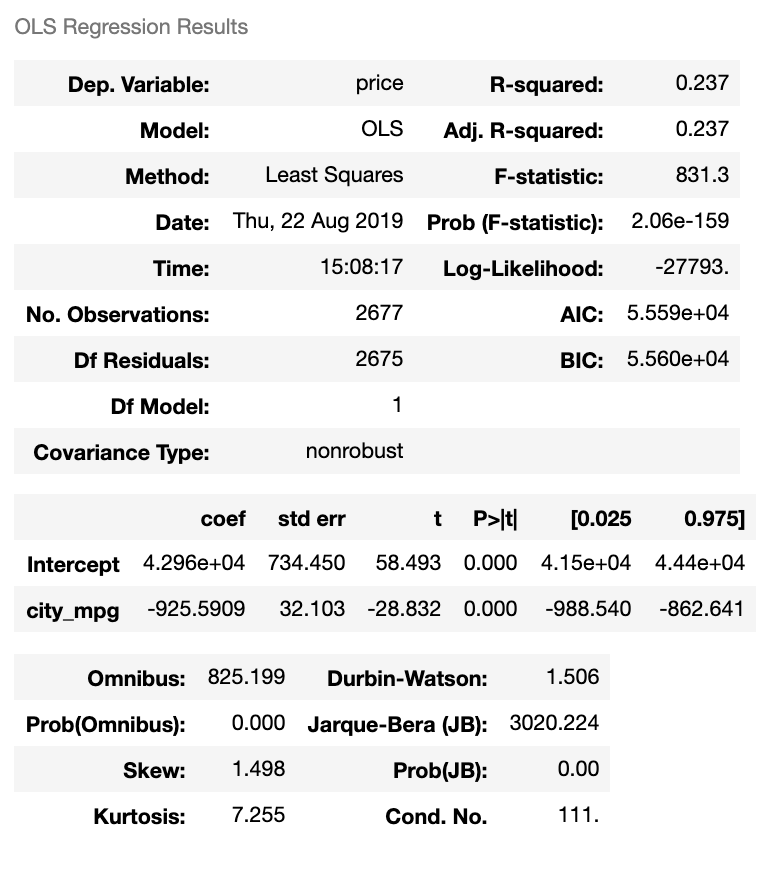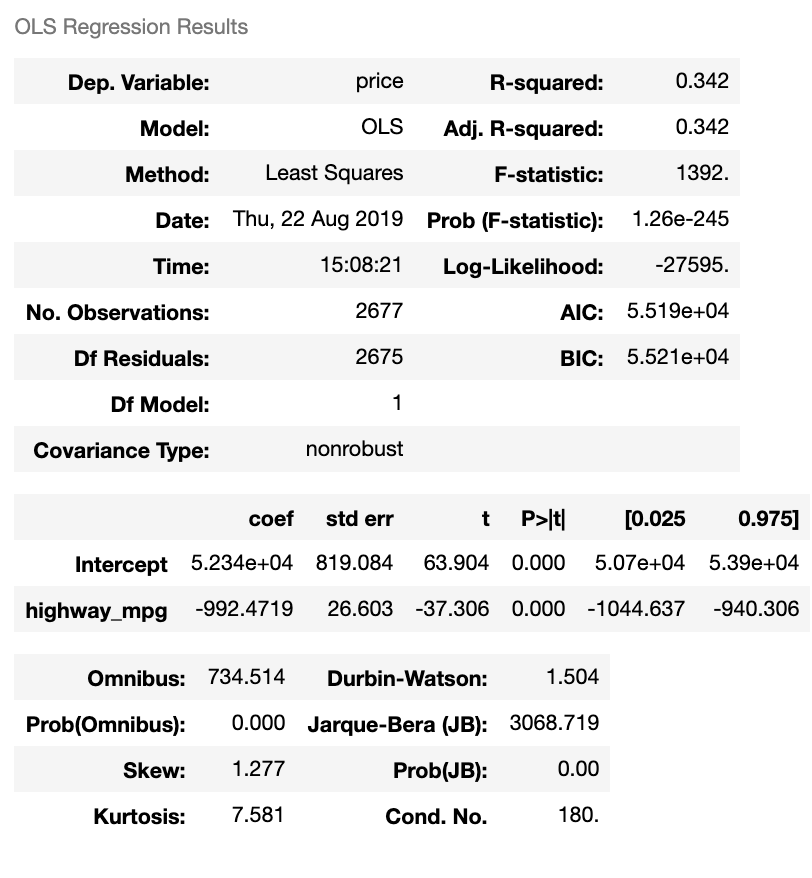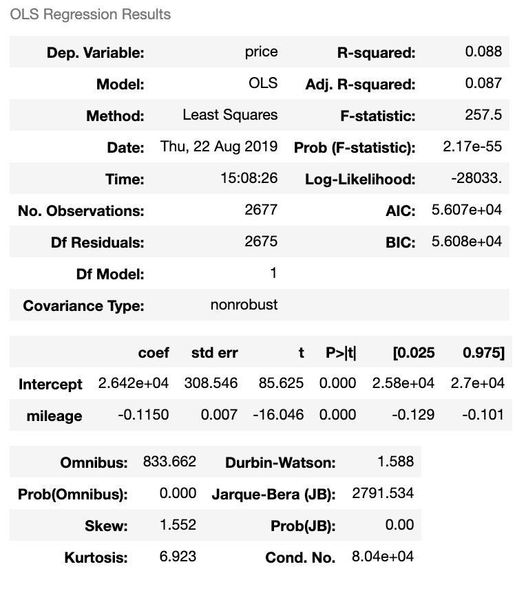

As an experiment, we also attempted to run a linear regression on the categorical variable **makes**.  The results provided a somewhat stronger R² value, which told us that the make of each car contributed somewhat to total pricing of the car.  The results of our linear regression are below:

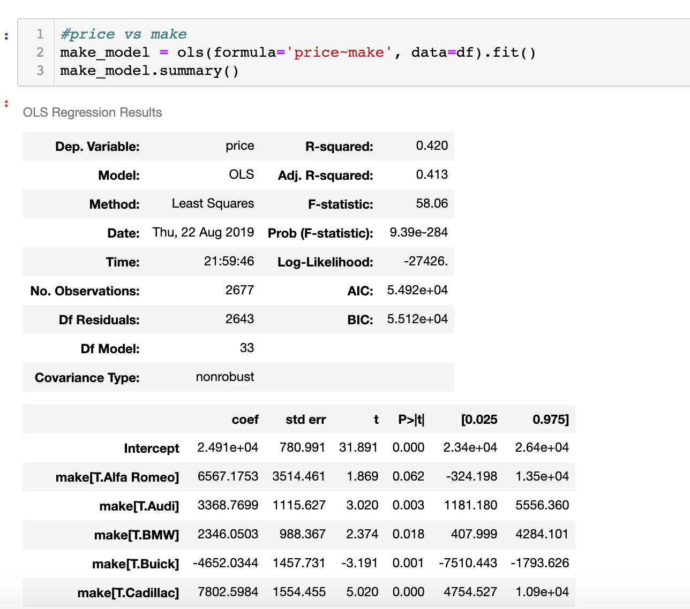

Given that the R² values really never go to ranges we deem satisfactory to accomodate the randomness we are seeing, our next step was to combine all variables and see if that would improve our results, setting Acura as our control make.  This dramatically improved our results, increasing our R² values to .709.  In addition, while our P-values were well within our established .05 limit, we were able to discern a few interesting coefficients that better described the relation between our variables and our target variable.

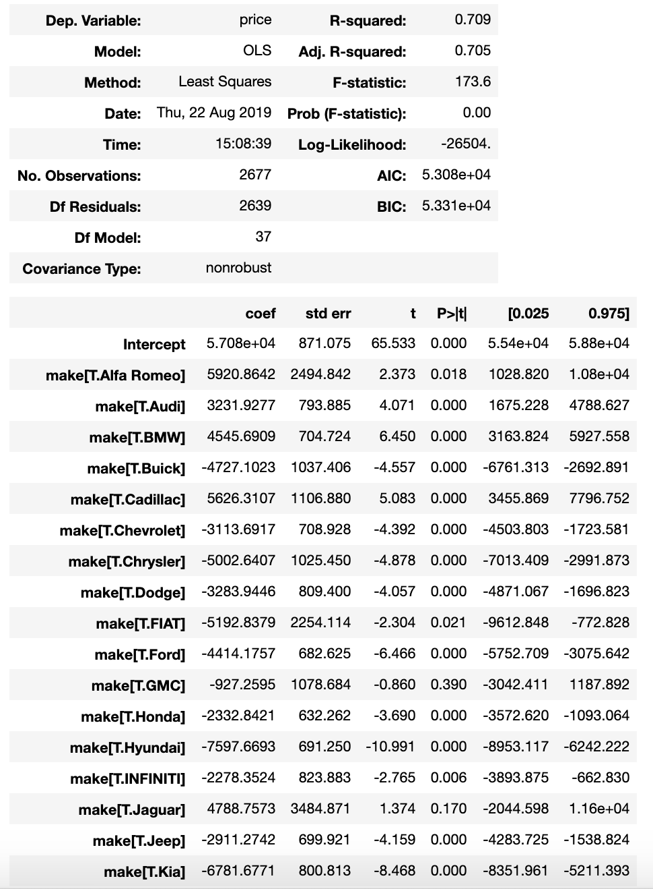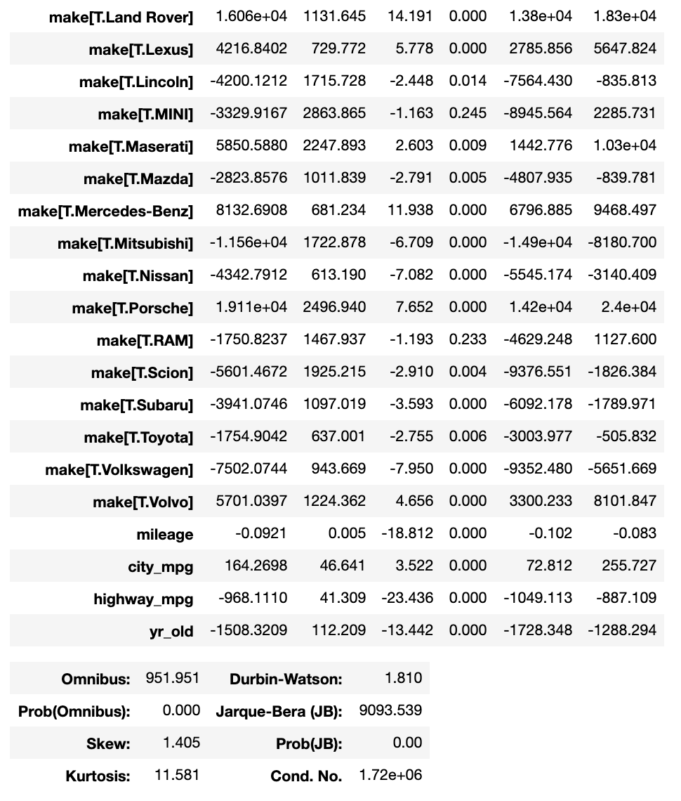

In order to improve our correlation, then next step we took was to take the natural log of our target variable in order to see if we could further refine our results.  This greatly increased our R² to .752 and our P-values remained in line within our established .05 limit.  We did attempt to take the natural log of the other variables, but it produced no signifnicant change and so we did not pursue alternative methods.  Our OLS and residual graphs are below:

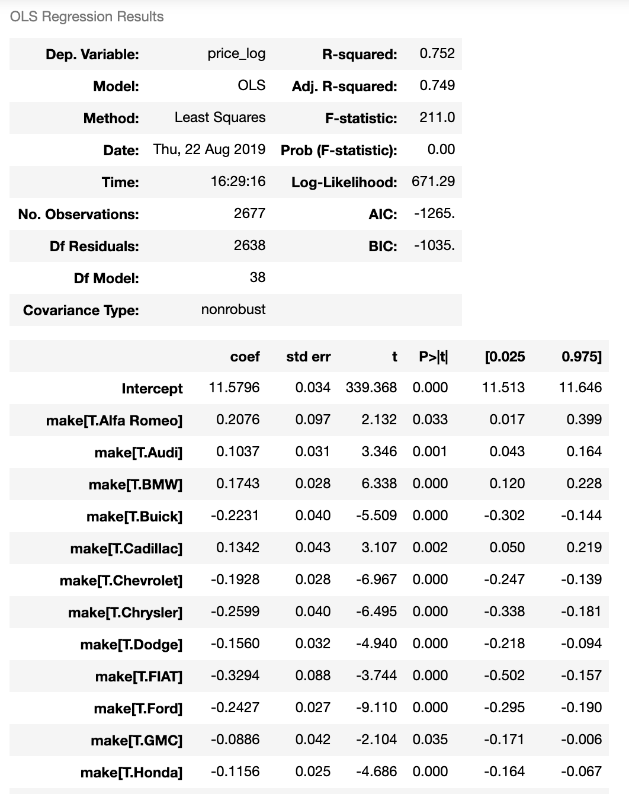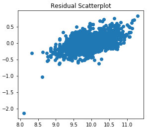

Due to the significant increases in price correlation we were seeing with some of the more recognized high end brands, we also explored the effect of luxury vehichles on the price of a used car.  We deemed this a necessary investigation as many of the farther flung points in our target variable were represented by luxury vehichles.  We grouped the vehichles recognized as luxury vehichles into their own separate variable in our data frame where if the car was a luxury vehichle, the new column would reflect a "1" via the following code:

```python
luxury = ['Mercedes-Benz', 'BMW', 'Lexus', 'Acura', 'Audi', 'INFINITI', 'Cadillac', 'Land Rover', 'Volvo', 'Lincoln', 'Maserati', 'Alfa Romeo', 'Porsche', 'Jaguar']
df['luxury'] = np.where(df['make'].isin(luxury), 1, 0);
```

This is a bit biased based on our own opinion of what we consider a "luxury" make.  For example, despite its price we left off Mini, Volkswagen, and Buick, but included Lincoln and Cadillac.  Whether or not these brands should or should not have been included is debatable based on one's perception of the brand, and we may re-evaluate our luxury critera in further exploration of these data to refine our model more.  In the end, our luxury investigation yielded some interesting information, but did not help much in the way of correlation.  Of course, we understand isolating for a selection of outliers will not help us refine our model, but it did yield a correlation of $8208.  That is, having a luxury car is likely to increase the resale value of your car by about $8208 against the control make. Its nice to know the effect having a luxury car will have against other cars, or what someone looking to sell their car is competing against.  Our OLS and residual graphs are below:

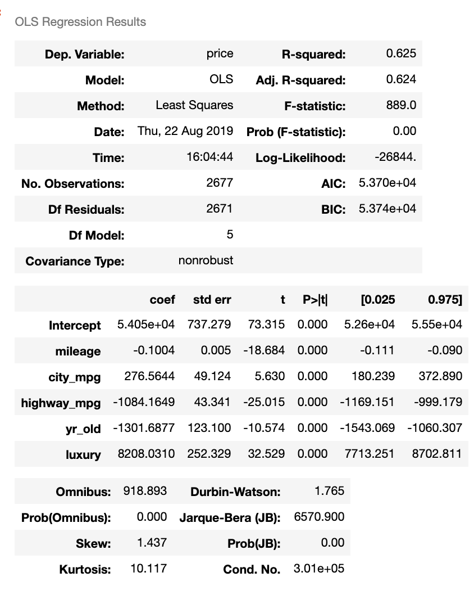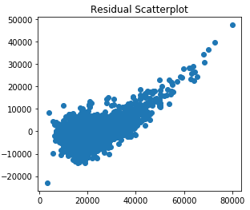

## Final Model

Based on our refinements, we selected the model that combined all variables with the natural log of our target variable.  Due to the high R² value we felt it was the most valuable model thus far.  Further refinement however should be done to increase the viability of the model.  Below is a recap of our OLS, along with a linear regression plotting actual price with predicted price and finally the residuals for our model.

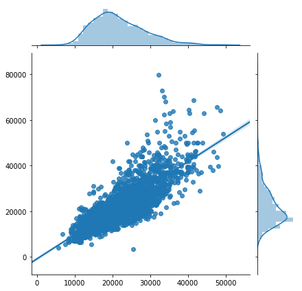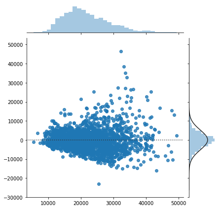

Finally, based on the coefficients we obtained, we were able to create a working function that will allow anyone with a bit of Python knowledge to calculate the price of their own ().  We invite you to try it out.  All you need to do is run the first 3 entries, enter the requested numbers, then run the last 2 entries and you'll have your price.

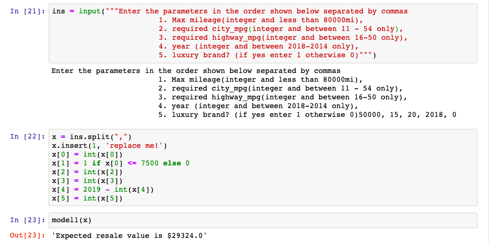


