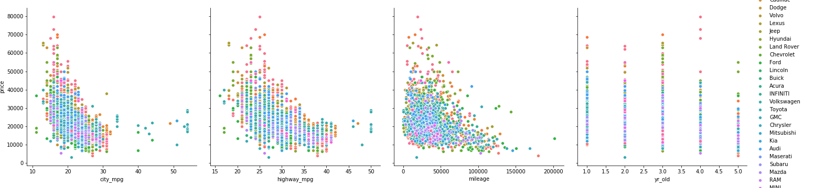

# mod2_project
mod 2 final project

# Hypothesis

Our project is an exploration as to whether we can use statistical analysis to predict the price of a used car based on the variables typically supplied by auto dealers and manufacturers.

# Data Collection and Cleaning

Through scraping of Cars.com, we were able to obtain 2607 observations post cleaning.  Our criteria was that these were dealer sold only, located within 10 miles of zip code 10004, no restriction on make or models, and that the model years were limited between 2014 to 2018.  These obeservations, post scraping were stored in 2 separate JSON files representing the 2 attempts we made to scrape data, the first to test our scraping code, the second to increase our sample size and avoid being blocked from the page altogether.  A third attempt was made to increase our sample size, however this led to our IP address being blocked for 2 days and thus we were unable to increase our sample size in the time given.

Factors that were cleaned included observations where information in the particular listing was not available for the below categories:  

**Mileage**

**Miles per gallon**

**Year**

Additionally, the data was pruned back to remove high-priced outliers representing rare cars like Bentleys are Rolls Royces.  Those makes were not specifically targeted for removal, but where their prices exceeded $90,000, we felt were not truly representative of the majority of the used car market.  We however, did fail to account for typos in car listing, particularly for 1 2017 Toyota Highlander that was priced unusally low at $3298.  Our initial assumption was that there was something wrong with the car that the dealer was not required to list in the standard car statistics but may have been available in the description.  It was later determined after modelling that this was a typo in the listing at the time of data gathering and that the true price should have included an extra 0, bringing the price to $32,980.  Further refinement of the model will include removal of this outlier, or a more thorough vetting of the data to watch out for these errors.

Further columns were removed from the data set which were regarded as not pertinent to our model.  This included the following categories:

**VIN number **

**Stock number**

**Internal color **

**Trim ** 

- **VIN number** and **stock number** were removed as they were not pertinent to modeling price comparison, although we do recognize they can play a role in a customer's purchase decision via a VIN lookup or enquiries of availability to the particular dealer listing the car, they do not materially affect the price.
- **Internal color** was judged as immaterial to value as manufacturers typically match certain interior colors with external colors, leaving very little choice for the consumer.  While certainly relevant to a buyer's interest, unless the color was unusual or custom, it was estimated that it would have little bearing on price.  We did check the colors present in the data set and did not notice any that particularly stood out as being a custom job.  Again, as with VIN and Stock Number, they may effect whether or not the car is purchased, but does not affect the final price.
- Lastly **trim**, while available as a category was frequently NOT filled in by dealers.  That information is typically assumed with the particular car model, and through enquiries we were able to determine that any extra packages that a car may possess is not factored into pricing by dealerships looking to buy tradeins which they then turn around to sell.  

# Analysis

Our initial analysis of the data started with a pairplot using the Python Seaborn library.  Initial results using all available continuous variables resulted in no obvious associations or correlations, as seen below:

Further examination through the OLS Stats function from the SciPy library revealed some correlation, but not enough to reliable use any of the continuous variables indivudually to help predict price.  The results of our regression analysis are below:

![]

